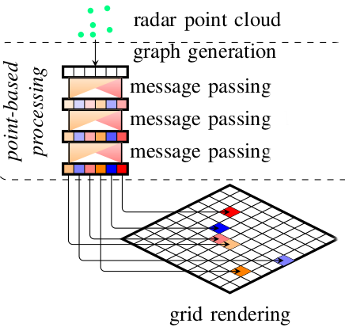

# Hybrid GNN Feature Extraction Model

# Introduction
- This project has the goal of developing, training and optimizing a model called GraphPillars, a hybrid architecture, on the ViewOfDelft Radar dataset for 3D object detection
- This model combines grid- and point-based processing to improve the detection performance and orientation estimation of radar-based object detection networks
- The existing framework OpenPCDet is used extensively for the purpose of this project which relies heavily on Torch packages
- All necessary features and packages of the source code will function as before but with additional modules and scripts
- This model is to be compared with various other models available and is expected to outperform standard models in the market

# OpenPCDet Data Flow Pipeline

## 1. Data Preparation
### Point Cloud Input
- Raw point cloud data input
- Data preprocessing and augmentation
  - Random flipping
  - Random rotation
  - Random scaling
### Data Processing
- Model dependent processing
- Anchor generation
  - Create predefined anchors based on config
  - Used Anchor Head Multi to create different anchors for the same point for different sized classes and their respective parameters
- Target assignment
  - Match anchors to ground truth boxes

## 2. Network Forward Pass
### Backbone Network
- Process the raw/voxelized/pillar point cloud data
- Extract spatial features
- Generate feature maps

### Dense Head

- Take backbone spatial features as input
- Predict box refinements from anchors
- Generate classification scores

### Additional Heads (model dependent)
- RoI head for second-stage refinement
- Point head for point-wise refinement
- Other model-specific heads

## 3. Loss Calculation
### Classification Loss
- Calculation of classification losses (cls_loss) through focal loss implementation

### Regression Loss
- Calculation of box regression loss (box_loss) through Smooth-L1/IoU loss implementation

# GraphPillars model Pipeline
## 0. Overview
- The method integrates point-based and grid-based approaches by first using a point-processing network to extract rich geometric features and local context from raw point cloud data including velocity and RCS information. 
- These learned point features are then projected onto a bird's eye view (BEV) grid where a standard object detection network processes them further to identify objects.

  
  
<em>Fig 1: Overview of the GraphPillars pipeline  </em>

## 1. Data Preparation
### Point Cloud Input (same as general pipeline)
- Raw point cloud data input
- Data preprocessing and augmentation
  - Random flipping
  - Random rotation
  - Random scaling
### Data Processing
- Graph generation
  - Point cloud to graph format
- Anchor generation
  - Create predefined anchors based on config
  - Used Anchor Head Multi to create different anchors for the same point for different sized classes and their respective parameters
- Target assignment
  - Match anchors to ground truth boxes

## 2. Backbones / Network Forward Pass
### Point to Graph Conversion
- Used 2 techniques in clustering points to form the graph
  - K-Nearest Neighbors : Connects each point to its k-closest points regardless of spatial distance
  - Radius based clustering : Create edges between points only if they fall within a fixed radius sphere

  
  
<em>Fig 2: K-nearest neighbor graph computation done batch-wise  </em>

### 3D Backbone Network 
- The point cloud in graph format, is used by the two following graph neural networks (GNN), which aggregates information from the graph of spatially proximal points :
#### GCNConv (Graph Convolutional Network) 
- Aggregates node features based on their direct neighbors using learned weight matrices and normalized adjacency information
- This network transforms point cloud features through a series of graph convolutions to learn
    meaningful representations of the point cloud structure
- Implemented in two ways :
  - Graph convolutional layer with enhanced message passing, and processing using a MLP, and feature aggregation using max pooling
  - Graph convolutional layer with simple message passing, using linear transformations and normalization of messages with mean aggregation
#### GAT (Graph Attention Network) 
- GAT networks learn to dynamically weight neighbor contributions through attention mechanisms that determine the importance of each neighbor node 
- These weights are learned by comparing node features, allowing the network to focus on the most relevant connections in the graph structure
- The network architecture consists of:
    - Three GAT layers with increasing receptive field
    - Batch normalization after each GAT layer
    - Residual connections and edge features for better feature learning

### Map to BEV (GNNPointScatter)

- Scatters point-based GNN features into a regular 3D grid and produces BEV (Bird's Eye View) features by averaging multiple points that fall into
    the same voxel
  - Converts point coordinates into voxel grid indices and filters points outside defined boundaries
  - Groups and averages features from multiple points that fall within the same voxel space
  - Transforms 3D voxel coordinates into linear indices for efficient processing
  - Reshapes aggregated features into a regular grid format suitable for BEV (Bird's Eye View) representation

  
  
<em>Fig 3: The local context of points relative to each other can already be learned in the
point-based processing, before the coarse resolution of the grid discretizes the positions  </em>

### Backbone 2D Network
- Two backbone networks are used :
  - BaseBEVBackbone : Sequential 2D convolution network with configurable blocks for downsampling/upsampling
, configurable layers/strides/filters, optional focus module, and outputs 2D spatial features
  - ResNet-FPN Backbone : 
    - Encoder: Sequential Bottleneck blocks (conv1x1→3x3→1x1) with downsampling through 5 stages
    - Decoder: FPN with lateral connections and deconvolution layers
    - Flow: Input → backbone extraction  → lateral processing → deconvolution upsampling → multi-scale outputs

  
  
<em>Fig 4: After grid rendering, a convolution backbone is used to extract
feature maps using a ResNet and Feature Pyramid Network (FPN) like architecture  </em>

  - It has been developed based on the PIXOR detector architecture, that implements a similar bottleneck structure but performs upsampling only two times

  
  
<em>Fig 5: Pixor Network Architecture  </em>

### Dense Heads (Three heads for three different sized class objects)
- The dense head module is a distinct learning network that is important for 3D object detection as it is the final step before post processing
- We have implemented our models using single anchor head (BaseBEVBackbone), as well as multi-feature scale anchor heads (ResNet-FPN backbone)
- To predict the final OBBs, we use separate, fully convolutional (CNN) detection heads for different groups of classes
- For example, the classes bus, truck, pickup and car trailer are combined in one head, which is attached to a feature
map of a relatively low resolution
- In contrast, the detection head for vulnerable road users (VRUs) is connected to a
feature map of a finer grid resolution
### Flowchart Representation of GraphPillars

  
  
<em>Fig 6: An overview of how the data flows and the implementation works  </em>

## 3. Loss Calculation
### Classification Loss
- calculation of classification losses (cls_loss) through focal loss implementation

### Regression Loss
- calculation of box regression loss (box_loss) through Smooth-L1/IoU loss implementation
on